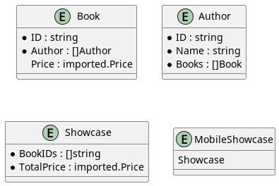

# puml
Go source files scanner and class diagram PlantUML text generator

#### only std lib packages, no external dependencies

### renderer https://plantuml.com/

### usage:
`puml <path to dir with go files> <path to out.puml>`

### example
source code:
```
package example

type Book struct {
	ID     string `json:"id"`
	Author []Author
	Price  *imported.Price
}

type Author struct {
	ID    string `json:"id"`
	Name  string `json:"name"`
	Books []Book
}

type Showcase struct {
	BookIDs    []string `json:"book_ids"`
	TotalPrice imported.Price
}

type MobileShowcase struct {
	*Showcase
}
```

simple clone this repo and run `go run main.go ./example ./example/sample.puml`

it will generate sample.puml file (even though go code is not valid)
```
@startuml

entity Book {
	*ID : string
	*Author : []Author
	Price : imported.Price
}

entity Author {
	*ID : string
	*Name : string
	*Books : []Book
}

entity Showcase {
	*BookIDs : []string
	*TotalPrice : imported.Price
}

entity MobileShowcase {
	Showcase
}
 
@enduml
```

then, use preferred renderer and it will looks like:
